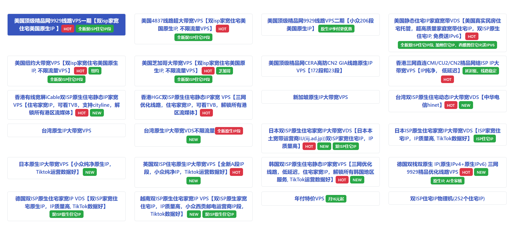
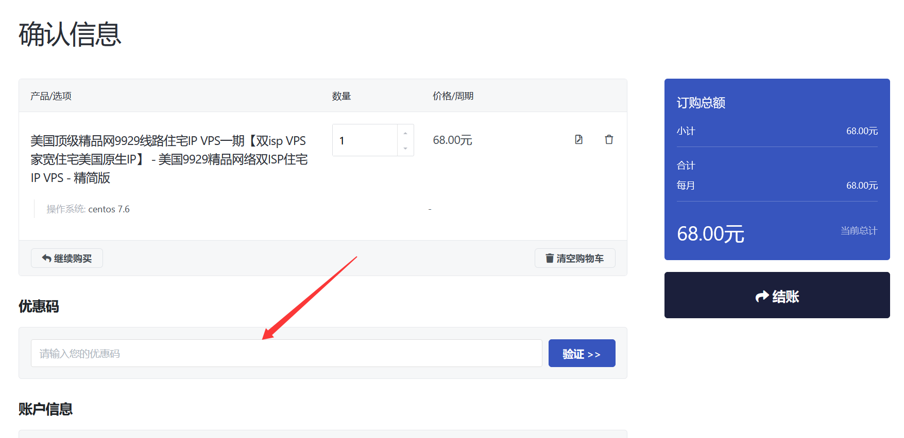

# LisaHost丽萨主机优惠整理2026 跨境电商 ISP家庭网络必备VPS

丽萨主机商（LiSaHost），这个国内的专属提供出海电商业务需要的家庭网络、ISP双线网络、原生IP的云服务商。如果我们有需要 AI、社交平台、跨境电商等用途，你肯定是有需要选择这个主机商的。

我们可以看到，丽萨主机在美国洛杉矶、纽约、芝加哥、中国香港、日本、新加坡、中国台湾、韩国、英国、德国和越南等多个地区部署有服务器节点，并根据不同机房提供 CN2 GIA、AS9929、AS4837、CMI、CU2 等优化线路，以及 HGC、iCable、HiNet、IIJ 等本土运营商网络产品。这个主机更强调 IP 和网络质量，部分产品提供双 ISP 住宅原生 IP、静态住宅 IP以及大带宽不限流量方案，因此除了常规网站搭建和服务器应用之外，更加适合跨境电商、海外社交媒体、本土化业务以及对 IP 类型和地区属性有特殊要求的用户。

## 丽萨主机商机房、IP特点、网络整理

我们在开始介绍他们的VPS方案之前，直接先用一个表格看看他们的机房和网络特点，这样也有助于选择对应适合的产品。

| 国家/地区 | 机房     | 主要网络/线路              | IP 类型                  | 主要特点                                   |
| --------- | -------- | -------------------------- | ------------------------ | ------------------------------------------ |
| 美国      | 洛杉矶   | AS9929、AS4837、CN2 GIA 等 | 原生IP、双ISP住宅IP      | 产品最丰富，可选精品线路、大带宽及高防方案 |
| 美国      | 纽约     | 国际网络/BGP               | 双ISP住宅IP              | 美国东部节点，大带宽、住宅IP方案           |
| 美国      | 芝加哥   | 国际网络/BGP               | 双ISP住宅IP              | 美国中部节点，大带宽、大流量方案           |
| 中国香港  | 香港     | CMI、CU2、CN2 等           | ISP IP、iCable/HGC住宅IP | 大陆低延迟，可选三网优化及香港本土住宅IP   |
| 新加坡    | 新加坡   | 国际网络                   | 原生IP                   | 面向新加坡及东南亚业务，大带宽方案         |
| 中国台湾  | 台湾     | 台湾本地网络               | 原生IP                   | 台湾本地业务及流媒体等应用                 |
| 日本      | 日本     | 三网优化、国际网络         | 日本原生IP               | 面向日本业务，同时兼顾大陆访问             |
| 韩国      | 韩国     | 三网优化                   | 双ISP住宅静态IP          | 韩国本土住宅IP，大陆访问延迟相对较低       |
| 英国      | 英国     | 国际网络                   | 双ISP住宅原生IP          | 面向英国及欧洲业务，住宅IP产品             |
| 德国      | 法兰克福 | AS9929优化                 | 原生IPv4 + IPv6          | 欧洲节点，双栈原生IP，兼顾大陆优化         |
| 越南      | 越南     | 越南本地/国际网络          | 双ISP住宅IP              | 越南本土住宅IP，适合东南亚业务             |

## 丽萨主机最新九折通用优惠券

如果我们有需要选购丽萨主机VPS，我们可以使用下面的优惠券，任意订单通用九折。

优惠券：**TS-CBP205DQJE**

申请：[丽萨主机官网网站](https://lisahost.com/aff.php?aff=85)

如图所示的位置，输入优惠券激活即可。

## 丽萨主机家庭网络VPS推荐套餐计划

根据上面的表格，我们可以看到丽萨主机商提供多个地区的ISP家庭网络、原生IP VPS。在这里，我们挑选几个机房和方案，如果你有需要选择可以直接到官方参考。

**台湾原生IP VPS**

| **内存** | **CPU** | **NVMe** | **流量** | **带宽** | **价格** | **购买**                                               |
| -------- | ------- | -------- | -------- | -------- | -------- | ------------------------------------------------------ |
| 1G       | 1核     | 10G      | 2T/月    | 300M     | 366元/年 | **[链接](https://lisahost.com/aff.php?aff=85&gid=82)** |
| 1G       | 1核     | 10G      | 4T/月    | 500M     | 48元/月  | **[链接](https://lisahost.com/aff.php?aff=85&gid=36)**       |
| 1G       | 1核     | 20G      | 6T/月    | 1Gbps    | 68元/月  | **[链接](https://lisahost.com/aff.php?aff=85&gid=36)**       |
| 2G       | 2核     | 40G      | 10T/月   | 1Gbps    | 88元/月  | **[链接](https://lisahost.com/aff.php?aff=85&gid=36)**       |
| 4G       | 4核     | 80G      | 20T/月   | 1Gbps    | 188元/月 | **[链接](https://lisahost.com/aff.php?aff=85&gid=36)**       |
| 2G       | 2核     | 40G      | 不限     | 200M     | 398元/月 | **[链接](https://lisahost.com/aff.php?aff=85&gid=36)**       |
| 4G       | 4核     | 80G      | 不限     | 500M     | 598元/月 | **[链接](https://lisahost.com/aff.php?aff=85&gid=36)**       |

**韩国双ISP家庭网络三网优化VPS**

| **内存** | **CPU** | **NVMe** | **流量** | **带宽** | **价格**  | **购买**                                         |
| -------- | ------- | -------- | -------- | -------- | --------- | ------------------------------------------------ |
| 1G       | 1核     | 20G      | 3T/月    | 100M     | 99元/月   | **[链接](https://lisahost.com/aff.php?aff=85&gid=23)** |
| 2G       | 2核     | 40G      | 5T/月    | 150M     | 188元/月  | **[链接](https://lisahost.com/aff.php?aff=85&gid=23)** |
| 4G       | 4核     | 80G      | 10T/月   | 200M     | 388元/月  | **[链接](https://lisahost.com/aff.php?aff=85&gid=23)** |
| 2G       | 2核     | 40G      | 不限     | 50M      | 798元/月  | **[链接](https://lisahost.com/aff.php?aff=85&gid=23)** |
| 4G       | 4核     | 80G      | 不限     | 100M     | 1688元/月 | **[链接](https://lisahost.com/aff.php?aff=85&gid=23)** |

**越南家庭网络ISP VPS**

| **内存** | **CPU** | **NVMe** | **流量** | **带宽** | **价格**  | **购买**                                               |
| -------- | ------- | -------- | -------- | -------- | --------- | ------------------------------------------------------ |
| 1G       | 1核     | 20G      | 3T/月    | 100M     | 88元/月   | **[链接](https://lisahost.com/aff.php?aff=85&gid=16)** |
| 2G       | 2核     | 40G      | 6T/月    | 150M     | 129元/月  | **[链接](https://lisahost.com/aff.php?aff=85&gid=16)** |
| 4G       | 4核     | 80G      | 20T/月   | 200M     | 599元/月  | **[链接](https://lisahost.com/aff.php?aff=85&gid=16)** |
| 2G       | 2核     | 40G      | 不限     | 100M     | 899元/月  | **[链接](https://lisahost.com/aff.php?aff=85&gid=16)** |
| 4G       | 4核     | 80G      | 不限     | 200M     | 1899元/月 | **[链接](https://lisahost.com/aff.php?aff=85&gid=16)** |
| 1G       | 1核     | 10G      | 1T/月    | 100M     | 699元/年  | **[链接](https://lisahost.com/aff.php?aff=85&gid=16)** |

**美国双ISP AS9929 VPS**

| **内存** | **CPU** | **NVMe** | **流量** | **带宽** | **价格**  | **购买**                                               |
| -------- | ------- | -------- | -------- | -------- | --------- | ------------------------------------------------------ |
| 1G       | 1核     | 10G      | 600G/月  | 50M      | 499元/年  | **[链接](https://lisahost.com/aff.php?aff=85&gid=61)** |
| 1G       | 1核     | 10G      | 1T/月    | 50M      | 68元/月   | **[链接](https://lisahost.com/aff.php?aff=85&gid=12)**       |
| 1G       | 1核     | 20G      | 2T/月    | 60M      | 88元/月   | **[链接](https://lisahost.com/aff.php?aff=85&gid=12)**       |
| 2G       | 2核     | 40G      | 4T/月    | 80M      | 158元/月  | **[链接](https://lisahost.com/aff.php?aff=85&gid=12)**       |
| 4G       | 4核     | 80G      | 8T/月    | 100M     | 388元/月  | **[链接](https://lisahost.com/aff.php?aff=85&gid=12)**       |
| 2G       | 2核     | 40G      | 不限     | 20M      | 388元/月  | **[链接](https://lisahost.com/aff.php?aff=85&gid=12)**       |
| 4G       | 4核     | 80G      | 不限     | 50M      | 1288元/月 | **[链接](https://lisahost.com/aff.php?aff=85&gid=12)**       |

**美国西雅图真家宽/静态住宅VDS**

| **内存** | **CPU** | **NVMe** | **流量** | **带宽** | **价格** | **购买**                                         |
| -------- | ------- | -------- | -------- | -------- | -------- | ------------------------------------------------ |
| 1G       | 1核     | 20G      | 3T/月    | 100Mbps  | 129元/月 | **[链接](https://lisahost.com/aff.php?aff=85&gid=33)** |
| 2G       | 2核     | 40G      | 6T/月    | 200Mbps  | 209元/月 | [**链接**](https://lisahost.com/aff.php?aff=85&gid=33) |
| 4G       | 4核     | 80G      | 20T/月   | 300Mbps  | 699元/月 | [**链接**](https://lisahost.com/aff.php?aff=85&gid=33) |
| 1G       | 1核     | 20G      | 不限     | 50Mbps   | 299元/月 | **[链接](https://lisahost.com/aff.php?aff=85&gid=33)** |
| 2G       | 2核     | 40G      | 不限     | 100Mbps  | 399元/月 | **[链接](https://lisahost.com/aff.php?aff=85&gid=33)** |
| 4G       | 4核     | 80G      | 不限     | 200Mbps  | 599元/月 | **[链接](https://lisahost.com/aff.php?aff=85&gid=33)** |

**英国双ISP 家庭网络VPS**

| **内存** | **CPU** | **NVMe** | **流量** | **带宽** | **价格** | **购买**                                         |
| -------- | ------- | -------- | -------- | -------- | -------- | ------------------------------------------------ |
| 1G       | 1核     | 10G      | 6T/月    | 300M     | 68元/月  | **[链接](https://lisahost.com/aff.php?aff=85&gid=14)** |
| 2G       | 2核     | 20G      | 8T/月    | 500M     | 100元/月 | [**链接**](https://lisahost.com/aff.php?aff=85&gid=14) |
| 4G       | 4核     | 80G      | 20T/月   | 1Gbps    | 300元/月 | [**链接**](https://lisahost.com/aff.php?aff=85&gid=14) |
| 2G       | 2核     | 40G      | 不限     | 200Mbps  | 398元/月 | [**链接**](https://lisahost.com/aff.php?aff=85&gid=14) |
| 4G       | 4核     | 80G      | 不限     | 500Mbps  | 598元/月 | [**链接**](https://lisahost.com/aff.php?aff=85&gid=14) |

PS：以上只是丽萨主机商的部分VPS产品，详细实际的可以到[官网查看](https://lisahost.com/aff.php?aff=85)。

## LisaHost VPS 如何选择

从上面的各各机房，各个线路，我们可以根据实际的需要的业务选择。针对各地区的外贸电商或者自媒体需要选择。

如果我们要求国内操作速度较好的，那你肯定需要CN2 GIA精品网络的。如果你要求本土兼容更好的，肯定是ISP家庭网络的。

如果你的账号要求敏感的，肯定要IP纯净高的。

丽萨主机商的ISP VPS受众还是比较多适合大家的。

